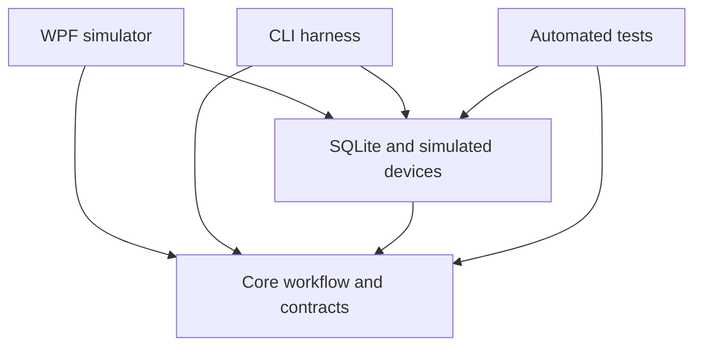
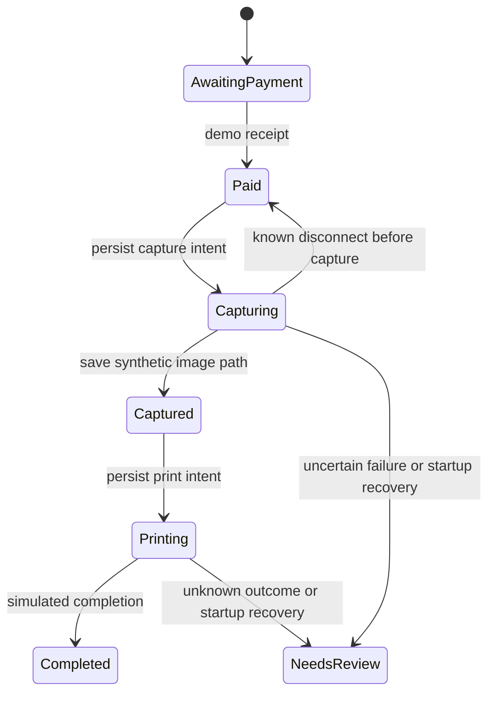

# Architecture

## Current foundation

The selected booth framework is C#/.NET 10 and WPF. See the [framework decision](specs/0001-windows-booth-framework.md).

Core contains session states and workflow rules. It references no UI toolkit, database package, or manufacturer SDK. Infrastructure implements the storage and device interfaces. Desktop composes the implementations and displays the simulator. The harness exercises the same workflow and storage without WPF.

The application is deliberately one local deployable unit. A separate service, broker, local HTTP server, and cloud backend are not required to run the simulator.

## Implemented simulator state

Receipt identifiers are unique in the local simulator database. Replaying the same receipt for the same session returns the existing state. Applying it to a different session fails. A receipt and the transition to Paid are committed together.

Transitions use the stored revision and expected stage to reject stale actions. Print uses the session identifier as its stable job identifier. Only one print is modeled per simulated session. A persisted Printing state after restart goes to NeedsReview. There is no automatic reprint and no claim of exactly once physical output.

The simulator does not model currency, partial payment, overpayment, cash refunds, multiple prints, customer cancellation, or a production money ledger. These need decisions grounded in the actual acceptor protocol.

## Proposed production boundaries

| Boundary | Responsibility | Status |
| --- | --- | --- |
| Booth runtime | Customer session, device ownership, local durable work | Simulator only |
| Camera adapter | SDK lifecycle, live view, capture, download, reconnect | Not implemented |
| Money adapter | Protocol parsing, event identity, credit and inhibition | Not implemented |
| Printer adapter | Rendered file submission, spooler evidence, physical outcome reconciliation | Not implemented |
| Image pipeline | Versioned recipes, CPU processing, beauty adjustments, frames and color management | Not implemented |
| Delivery worker | Durable upload queue, receipt of upload completion, protected download link | Not implemented |
| Fleet control | Device provisioning, configuration and content publication, health, update rollout | Not implemented |
| Admin tools | Recipe authoring and review, operator access, fleet operations | Not implemented |

Keep core customer processing local. A future durable outbox should queue uploads and synchronization. Do not display a working public download URL before its upload and access rules are established. Decide separately whether to offer a pending claim link during an outage.

A native SDK can hang or terminate its host process. The simulator's in process interfaces are not a resilience guarantee for native drivers. Validate each SDK and consider a dedicated worker process when its failure isolation warrants it.

## Data and files

SQLite holds small session metadata and demo receipt identities. Synthetic BMP files live on disk. Original customer images should remain separate from previews and final rendered outputs in a future implementation. Version published recipes and preserve the version used by each session.

Production schema migrations, backup and restore, encryption, deletion, outbox retries, and event auditing are future work. WAL and transactions alone do not settle those requirements.
