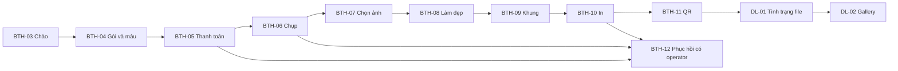
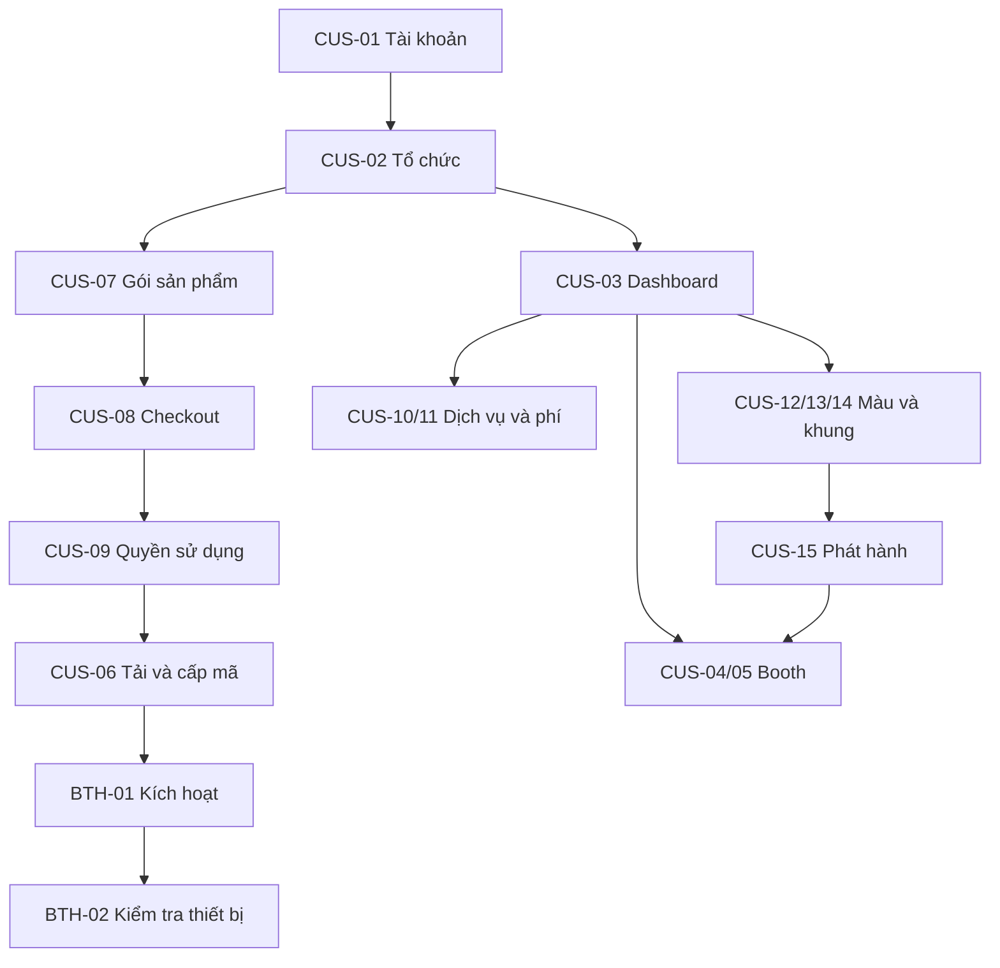
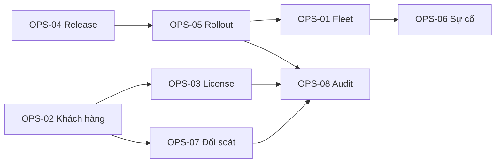

# Danh mục và luồng màn hình

40 màn hình chức năng. Một page có thể chứa tab, modal hoặc trạng thái thay vì tương ứng đúng một URL. Mã màn hình dùng để trao đổi BA/UI/UX độc lập với framework.

## Luồng khách chụp

Thứ tự gói/màu và thanh toán cần duyệt D-04. Mỗi phiên giữ snapshot giá/nội dung và không phụ thuộc Internet để hoàn thành công việc local.

## Luồng khách hàng thương mại

## Luồng nội bộ FotoAutomat

## Ứng dụng booth Windows

| Mã | Màn hình | Epic |
| --- | --- | --- |
| BTH-01 | [Cài đặt và kích hoạt booth](screens/bth-01.md) | EP-02 |
| BTH-02 | [Cấu hình và kiểm tra thiết bị](screens/bth-02.md) | EP-01 |
| BTH-03 | [Màn hình chào và trạng thái phục vụ](screens/bth-03.md) | EP-01 |
| BTH-04 | [Chọn gói chụp và màu](screens/bth-04.md) | EP-01 |
| BTH-05 | [Thanh toán tại booth](screens/bth-05.md) | EP-01 |
| BTH-06 | [Live view và chụp ảnh](screens/bth-06.md) | EP-01 |
| BTH-07 | [Xem và chọn ảnh](screens/bth-07.md) | EP-01 |
| BTH-08 | [Làm đẹp sau chụp](screens/bth-08.md) | EP-01 |
| BTH-09 | [Chọn khung và xác nhận bản in](screens/bth-09.md) | EP-01 |
| BTH-10 | [Tiến trình in và lỗi in](screens/bth-10.md) | EP-01 |
| BTH-11 | [Nhận file qua QR và kết thúc](screens/bth-11.md) | EP-07 |
| BTH-12 | [Vận hành cục bộ và xử lý phiên gián đoạn](screens/bth-12.md) | EP-01 |

## Cổng khách hàng thương mại

| Mã | Màn hình | Epic |
| --- | --- | --- |
| CUS-01 | [Đăng nhập, đăng ký và khôi phục tài khoản](screens/cus-01.md) | EP-02 |
| CUS-02 | [Thiết lập tổ chức khách hàng](screens/cus-02.md) | EP-02 |
| CUS-03 | [Tổng quan tài khoản và booth](screens/cus-03.md) | EP-03 |
| CUS-04 | [Danh sách booth](screens/cus-04.md) | EP-03 |
| CUS-05 | [Chi tiết booth và tác vụ từ xa](screens/cus-05.md) | EP-03 |
| CUS-06 | [Tải phần mềm và cấp mã kích hoạt](screens/cus-06.md) | EP-02 |
| CUS-07 | [So sánh gói thuê, mua vĩnh viễn và dịch vụ](screens/cus-07.md) | EP-04 |
| CUS-08 | [Checkout và kết quả thanh toán dịch vụ](screens/cus-08.md) | EP-04 |
| CUS-09 | [Giấy phép và thuê bao](screens/cus-09.md) | EP-04 |
| CUS-10 | [Dịch vụ trả phí và mức sử dụng](screens/cus-10.md) | EP-04 |
| CUS-11 | [Đơn hàng, thanh toán và chứng từ](screens/cus-11.md) | EP-04 |
| CUS-12 | [Thư viện công thức màu](screens/cus-12.md) | EP-05 |
| CUS-13 | [Tạo màu bằng AI và tinh chỉnh](screens/cus-13.md) | EP-05 |
| CUS-14 | [Thư viện và chỉnh sửa khung ảnh](screens/cus-14.md) | EP-05 |
| CUS-15 | [Phát hành nội dung tới booth](screens/cus-15.md) | EP-05 |
| CUS-16 | [Phiên chụp, doanh thu booth và giao file](screens/cus-16.md) | EP-03 |
| CUS-17 | [Thành viên và phân quyền](screens/cus-17.md) | EP-02 |
| CUS-18 | [Hỗ trợ và yêu cầu xử lý](screens/cus-18.md) | EP-03 |

## Quản trị nội bộ FotoAutomat

| Mã | Màn hình | Epic |
| --- | --- | --- |
| OPS-01 | [Tổng quan đội booth toàn hệ thống](screens/ops-01.md) | EP-03 |
| OPS-02 | [Hồ sơ khách hàng thương mại](screens/ops-02.md) | EP-04 |
| OPS-03 | [Quản lý quyền sử dụng và ngoại lệ thương mại](screens/ops-03.md) | EP-04 |
| OPS-04 | [Danh mục phiên bản và bộ cài](screens/ops-04.md) | EP-06 |
| OPS-05 | [Lập đợt cập nhật và theo dõi rollout](screens/ops-05.md) | EP-06 |
| OPS-06 | [Sự cố và lịch sử lệnh từ xa](screens/ops-06.md) | EP-03 |
| OPS-07 | [Đối soát phí dịch vụ và mức sử dụng](screens/ops-07.md) | EP-04 |
| OPS-08 | [Nhật ký kiểm toán và truy cập nội bộ](screens/ops-08.md) | EP-02 |

## Web nhận ảnh của khách chụp

| Mã | Màn hình | Epic |
| --- | --- | --- |
| DL-01 | [Mở QR và kiểm tra tình trạng giao file](screens/dl-01.md) | EP-07 |
| DL-02 | [Bộ ảnh và tải xuống trên điện thoại](screens/dl-02.md) | EP-07 |
